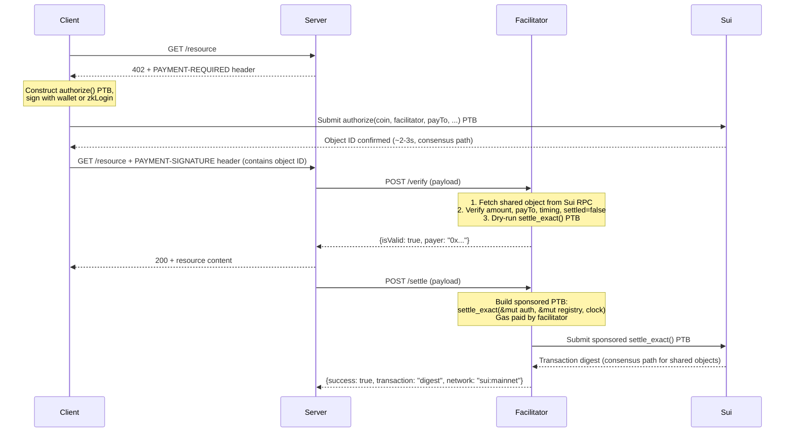

|   SIP-Number | |
|         ---: | :--- |
|        Title | Native x402 Payment Scheme for Sui |
|  Description | Defines a Sui-native payment scheme for the x402 protocol using Move objects and PTBs. |
|       Author | Alexandre Mourot (@alexandremourot) |
|       Editor | |
|         Type | Standard |
|     Category | Application |
|      Created | 2026-03-24 |
| Comments-URI | |
|       Status | |
|     Requires | |

## Abstract

This SIP defines two x402 payment schemes for Sui (`exact_sui` and `upto_sui`) backed by a Move module that creates on-chain payment authorizations. It extends the existing PTB-based approach (implemented in [`@x402/sui`](https://github.com/alexandre-mrt/x402-sui)) with shared authorization objects that support metered billing, cancellation, and facilitator-restricted settlement.

## Motivation

We've already built and shipped a working x402 implementation for Sui ([`@x402/sui`](https://github.com/alexandre-mrt/x402-sui)). It follows Coinbase's `scheme_exact_sui.md` spec: the client builds a PTB with `SplitCoins` + `TransferObjects`, signs it, and the facilitator dry-runs then executes the pre-signed transaction. No custom Move contracts. 42 tests passing, USDC on testnet and mainnet, gas sponsorship via `extra.gasOwner`. It works.

But after building it, we hit three walls that the basic approach can't solve:

1. **Metered billing.** The PTB approach fixes the transfer amount at signing time. If you're billing per LLM token or per MB transferred, you don't know the final cost when the client signs. You need an `upto` scheme where the payer locks a ceiling and the facilitator settles the actual consumption amount.

2. **On-chain authorization state.** With pre-signed transactions, the facilitator holds an opaque blob. The payer can't query what's pending on-chain. If the facilitator goes offline, the signed transaction just sits there, and the payer has no recourse. We want authorizations to be visible, queryable shared objects.

3. **Cancellation.** Once you sign a `SplitCoins` + `TransferObjects` PTB, you can't revoke it without the facilitator's cooperation. An on-chain `PaymentAuthorization` object can be cancelled by the payer directly, returning locked funds.

This SIP introduces a `x402::payment` Move module that addresses all three. It's designed to coexist with the basic PTB scheme: services that only need fixed-price payments can keep using `@x402/sui` as-is. The Move-based scheme is for cases where metered billing, cancellation, or on-chain verifiability matter.

### Design tradeoffs we're making

Sui's object model fits this well. PTBs compose the authorize-split-transfer-emit flow atomically, sponsored transactions let the facilitator cover gas (so USDC-only payers don't need SUI), and zkLogin gives AI agents ephemeral wallets via OAuth.

The cost: `PaymentAuthorization` is a shared object, so both authorization and settlement go through consensus (~2-3s) instead of the fast path (~400ms) that the basic scheme gets with owned-object transfers. We think that's fine. The resource is served after dry-run verification, not after on-chain settlement, so users don't actually wait for consensus. For latency-sensitive use cases, the basic `@x402/sui` scheme remains available.

## Specification

### 1. Network identifier

Sui uses CAIP-2 network identifiers as required by x402 v2:

| Network | CAIP-2 ID |
|---------|-----------|
| Mainnet | `sui:mainnet` |
| Testnet | `sui:testnet` |
| Devnet | `sui:devnet` |

### 2. Payment schemes

This SIP defines two payment schemes:

- **`exact_sui`**: The payer authorizes a fixed amount. Settlement transfers exactly that amount.
- **`upto_sui`**: The payer authorizes a maximum amount. Settlement transfers any amount up to the maximum, determined by the resource server at settlement time.

### 3. Move module: `x402::payment`

```move
module x402::payment {
    use sui::coin::{Self, Coin};
    use sui::event;
    use sui::clock::Clock;
    use sui::table::{Self, Table};
    use std::type_name::{Self, TypeName};

    // ===== Error codes =====
    const EExpired: u64 = 0;
    const EInvalidAmount: u64 = 1;
    const EUnauthorized: u64 = 2;
    const EAlreadySettled: u64 = 3;
    const EAmountExceedsMax: u64 = 4;
    const ENonceAlreadyUsed: u64 = 5;

    // ===== Structs =====

    /// A payment authorization created and signed by the payer.
    /// Shared object so the facilitator can access it for settlement.
    public struct PaymentAuthorization<phantom T> has key {
        id: UID,
        /// The coin locked for this payment
        coin: Coin<T>,
        /// Address of the payer (recorded at creation time)
        payer: address,
        /// The designated facilitator (only this address can settle)
        facilitator: address,
        /// The intended recipient address
        pay_to: address,
        /// Maximum amount authorized
        max_amount: u64,
        /// Unix timestamp (ms) after which this authorization is valid
        valid_after: u64,
        /// Unix timestamp (ms) after which this authorization expires
        valid_before: u64,
        /// Unique nonce to prevent replay
        nonce: vector<u8>,
        /// Whether this authorization has been settled or cancelled
        settled: bool,
    }

    /// Tracks used nonces to prevent replay attacks.
    /// Shared object, one per token type. Uses Table for O(1) lookup.
    public struct NonceRegistry<phantom T> has key {
        id: UID,
        used_nonces: Table<vector<u8>, bool>,
    }

    /// Emitted on successful settlement.
    public struct SettlementEvent has copy, drop {
        payer: address,
        payee: address,
        facilitator: address,
        amount: u64,
        nonce: vector<u8>,
        scheme: vector<u8>,
        coin_type: TypeName,
    }

    /// Emitted on cancellation.
    public struct CancellationEvent has copy, drop {
        payer: address,
        pay_to: address,
        refunded_amount: u64,
        nonce: vector<u8>,
        coin_type: TypeName,
    }

    // ===== Init =====

    /// Create and share a NonceRegistry for a given token type.
    /// Should be called once per token type during module deployment.
    public fun create_registry<T>(ctx: &mut TxContext) {
        let registry = NonceRegistry<T> {
            id: object::new(ctx),
            used_nonces: table::new(ctx),
        };
        transfer::share_object(registry);
    }

    // ===== Public functions =====

    /// Create a payment authorization by locking coins.
    /// Called by the payer (or the payer's agent via zkLogin).
    /// The authorization is shared so the facilitator can settle it.
    public fun authorize<T>(
        coin: Coin<T>,
        facilitator: address,
        pay_to: address,
        max_amount: u64,
        valid_after: u64,
        valid_before: u64,
        nonce: vector<u8>,
        ctx: &mut TxContext,
    ) {
        assert!(coin.value() >= max_amount, EInvalidAmount);
        assert!(valid_before > valid_after, EExpired);
        assert!(max_amount > 0, EInvalidAmount);

        let auth = PaymentAuthorization<T> {
            id: object::new(ctx),
            coin,
            payer: ctx.sender(),
            facilitator,
            pay_to,
            max_amount,
            valid_after,
            valid_before,
            nonce,
            settled: false,
        };
        transfer::share_object(auth);
    }

    /// Settle an exact payment. Transfers the full authorized amount to the payee.
    /// Only the designated facilitator can call this.
    public fun settle_exact<T>(
        auth: &mut PaymentAuthorization<T>,
        registry: &mut NonceRegistry<T>,
        clock: &Clock,
        ctx: &mut TxContext,
    ) {
        // Access control: only the designated facilitator can settle
        assert!(ctx.sender() == auth.facilitator, EUnauthorized);
        assert!(!auth.settled, EAlreadySettled);

        // Validate timing
        let now = clock.timestamp_ms();
        assert!(now >= auth.valid_after, EExpired);
        assert!(now < auth.valid_before, EExpired);

        // Validate nonce (replay protection, O(1) via Table)
        let nonce_copy = *&auth.nonce;
        assert!(!registry.used_nonces.contains(&nonce_copy), ENonceAlreadyUsed);
        registry.used_nonces.add(nonce_copy, true);

        // Validate amount
        assert!(auth.coin.value() >= auth.max_amount, EInvalidAmount);

        // Transfer exact amount to payee
        let payment = coin::split(&mut auth.coin, auth.max_amount, ctx);
        transfer::public_transfer(payment, auth.pay_to);

        // Return any excess to payer (if coin had more than max_amount)
        let excess = auth.coin.value();
        if (excess > 0) {
            let refund = coin::split(&mut auth.coin, excess, ctx);
            transfer::public_transfer(refund, auth.payer);
        };

        auth.settled = true;

        event::emit(SettlementEvent {
            payer: auth.payer,
            payee: auth.pay_to,
            facilitator: auth.facilitator,
            amount: auth.max_amount,
            nonce: *&auth.nonce,
            scheme: b"exact_sui",
            coin_type: type_name::get<T>(),
        });
    }

    /// Settle an upto payment. Transfers up to the authorized maximum.
    /// The actual amount is determined by the facilitator at settlement time.
    /// Only the designated facilitator can call this.
    public fun settle_upto<T>(
        auth: &mut PaymentAuthorization<T>,
        registry: &mut NonceRegistry<T>,
        clock: &Clock,
        actual_amount: u64,
        ctx: &mut TxContext,
    ) {
        assert!(ctx.sender() == auth.facilitator, EUnauthorized);
        assert!(!auth.settled, EAlreadySettled);

        // Validate timing
        let now = clock.timestamp_ms();
        assert!(now >= auth.valid_after, EExpired);
        assert!(now < auth.valid_before, EExpired);

        // Validate nonce
        let nonce_copy = *&auth.nonce;
        assert!(!registry.used_nonces.contains(&nonce_copy), ENonceAlreadyUsed);
        registry.used_nonces.add(nonce_copy, true);

        // Validate amount bounds
        assert!(actual_amount <= auth.max_amount, EAmountExceedsMax);
        assert!(actual_amount > 0, EInvalidAmount);

        // Transfer the actual amount to payee
        let payment = coin::split(&mut auth.coin, actual_amount, ctx);
        transfer::public_transfer(payment, auth.pay_to);

        // Return all remaining funds to payer
        let remainder = auth.coin.value();
        if (remainder > 0) {
            let refund = coin::split(&mut auth.coin, remainder, ctx);
            transfer::public_transfer(refund, auth.payer);
        };

        auth.settled = true;

        event::emit(SettlementEvent {
            payer: auth.payer,
            payee: auth.pay_to,
            facilitator: auth.facilitator,
            amount: actual_amount,
            nonce: *&auth.nonce,
            scheme: b"upto_sui",
            coin_type: type_name::get<T>(),
        });
    }

    /// Cancel an unsettled authorization. Only the payer can call this.
    /// Returns the locked coin to the payer and registers the nonce as used.
    public fun cancel<T>(
        auth: &mut PaymentAuthorization<T>,
        registry: &mut NonceRegistry<T>,
        ctx: &mut TxContext,
    ) {
        assert!(!auth.settled, EAlreadySettled);
        assert!(ctx.sender() == auth.payer, EUnauthorized);

        // Register nonce to prevent reuse after cancellation
        let nonce_copy = *&auth.nonce;
        if (!registry.used_nonces.contains(&nonce_copy)) {
            registry.used_nonces.add(nonce_copy, true);
        };

        // Return all funds to payer
        let refunded = auth.coin.value();
        if (refunded > 0) {
            let refund = coin::split(&mut auth.coin, refunded, ctx);
            transfer::public_transfer(refund, auth.payer);
        };

        auth.settled = true;

        event::emit(CancellationEvent {
            payer: auth.payer,
            pay_to: auth.pay_to,
            refunded_amount: refunded,
            nonce: *&auth.nonce,
            coin_type: type_name::get<T>(),
        });
    }
}
```

**Note on shared object lifecycle**: Settled `PaymentAuthorization` objects remain on-chain as shared objects with `settled = true` and an empty coin (value 0). Shared objects cannot be deleted in current Sui. This is a known tradeoff: the permanent storage cost per payment (~200 bytes) is the price of on-chain authorization state. Future Sui protocol changes enabling shared object deletion would resolve this. Alternatively, a future version of this specification could use `Option<Coin<T>>` to extract and destroy the coin, reducing the footprint to the struct fields only.

### 4. Deployment

The `x402::payment` module is published as an **immutable package** (no upgrade capability). This is intentional: payment infrastructure should not change under users' feet. The publisher calls `create_registry<SUI>` and `create_registry<USDC>` at deployment time to bootstrap the canonical registries. The registry object IDs are published in the facilitator's `/supported` endpoint and hardcoded in SDK constants.

If new token types need registries, anyone can call `create_registry<T>`, but facilitators should only accept the canonical registry for each type (verified by object ID).

### 5. PaymentPayload structure (off-chain, JSON)

The `PaymentPayload` is constructed by the client and sent in the `PAYMENT-SIGNATURE` HTTP header (base64-encoded). Unlike EVM/Solana schemes where this header contains a cryptographic signature over an off-chain message, the Sui scheme uses an on-chain object reference. The payer's authorization is already signed and submitted to Sui; the header provides the facilitator with the object ID to locate and settle it.

```json
{
  "scheme": "exact_sui",
  "network": "sui:mainnet",
  "payload": {
    "authorizationObjectId": "<UID of the PaymentAuthorization shared object>",
    "payer": "<Sui address of the payer>",
    "facilitator": "<Sui address of the designated facilitator>",
    "payTo": "<Sui address of the payee>",
    "amount": "1000000",
    "asset": "0x2::sui::SUI",
    "nonce": "<unique nonce, hex>",
    "validAfter": 1711234567000,
    "validBefore": 1711234867000
  }
}
```

For USDC on Sui, the `asset` field uses the deployed USDC coin type address.

### 5. Facilitator flow

The facilitator is responsible for verifying and settling payments. The flow leverages Sui's sponsored transactions:



#### Verification (`POST /verify`)

1. Fetch the `PaymentAuthorization` shared object from Sui RPC using the provided object ID
2. Verify the object exists, `settled == false`, and `payer` matches the claimed payer
3. Verify `pay_to`, `max_amount`, `valid_after`, `valid_before` match the `PaymentRequirements`
4. Dry-run a `settle_exact()` or `settle_upto()` PTB to confirm it would succeed
5. Return `{isValid: true, payer: "0x..."}` or `{isValid: false, invalidReason: "..."}`

#### Settlement (`POST /settle`)

1. Construct a PTB calling `settle_exact()` or `settle_upto()` with `&mut auth` and `&mut registry`
2. Sign as a **sponsored transaction** (facilitator pays gas)
3. Submit to Sui and await finality (~2-3s for shared objects via consensus)
4. Return `{success: true, transaction: "<digest>", network: "sui:mainnet", payer: "0x..."}`

### 6. PaymentRequirements (server-side)

The server advertises payment requirements via the `PAYMENT-REQUIRED` header:

```json
{
  "x402Version": 2,
  "accepts": [
    {
      "scheme": "exact_sui",
      "network": "sui:mainnet",
      "maxAmountRequired": "1000000",
      "resource": "https://api.example.com/v1/generate",
      "description": "0.01 USDC per API call",
      "mimeType": "application/json",
      "payTo": "0x<resource_owner_sui_address>",
      "asset": "0xdba34672e30cb065b1f93e3ab55318768fd6fef66c15942c9f7cb846e2f900e7::usdc::USDC",
      "maxTimeoutSeconds": 30,
      "outputSchema": null,
      "extra": {
        "facilitatorUrl": "https://facilitator.example.com",
        "gasOwner": "0x<facilitator_address_for_sponsorship>"
      }
    }
  ]
}
```

### 7. Supported assets

| Asset | Network | Coin Type | Decimals |
|-------|---------|-----------|----------|
| SUI | all | `0x2::sui::SUI` | 9 (MIST) |
| USDC | mainnet | `0xdba34672e30cb065b1f93e3ab55318768fd6fef66c15942c9f7cb846e2f900e7::usdc::USDC` | 6 |
| USDC | testnet | `0xa1ec7fc00a6f40db9693ad1415d0c193ad3906494428cf252621037bd7117e29::usdc::USDC` | 6 |

These are the same USDC coin types used by the `@x402/sui` SDK. Any fungible `Coin<T>` type on Sui can be used; the facilitator advertises supported assets via `GET /supported`.

### 8. zkLogin integration

AI agents and end users without Sui wallets can use zkLogin to create ephemeral keypairs authenticated via OAuth:

1. Agent authenticates via Google/Apple OAuth, obtains a JWT
2. Agent derives an ephemeral Sui keypair via zkLogin
3. Agent signs the `authorize()` PTB with the ephemeral key
4. The facilitator settles using sponsored transactions (agent pays no gas)

This enables the x402 vision of autonomous agent payments without private key management.

### 9. SIP-58 compatibility

When SIP-58 (Address Balances) is implemented, the payment scheme can be simplified:

- **Before SIP-58**: The payer must select and split a specific `Coin<T>` object to lock in the `PaymentAuthorization`. Coin selection logic is required.
- **After SIP-58**: The payer could authorize a transfer from their address balance directly, eliminating coin selection. The `authorize()` function may be adapted to debit from the address balance, depending on SIP-58's final API design.

This SIP is designed to work with both models. The `PaymentAuthorization` struct holds a `Coin<T>` which can be obtained either by coin selection (pre-SIP-58) or by balance withdrawal (post-SIP-58).

## Rationale

### Extending the basic scheme vs. starting from scratch

We built `@x402/sui` as a complete TypeScript SDK implementing the basic `scheme_exact_sui` spec: client builds a `SplitCoins` + `TransferObjects` PTB, signs it with Ed25519, facilitator dry-runs then executes. It works well for fixed-price payments. The `ExactSuiFacilitatorScheme` verifies balance changes from the dry-run, the `SettlementCache` prevents duplicate settlement, and gas sponsorship is handled via the `extra.gasOwner` field in `PaymentRequirements`.

But the limitations showed up quickly. We couldn't add metered billing because the amount is baked into the PTB at signing time. We couldn't add cancellation because a signed PTB can be executed by anyone who has it. And we couldn't give payers visibility into pending authorizations because the signed transaction is just a base64 blob sitting in the facilitator's memory. These aren't implementation bugs; they're structural constraints of the pre-signed transfer approach.

### On-chain objects vs. off-chain signatures

On EVM, x402 uses EIP-3009 because ERC-20 contracts already support `transferWithAuthorization`. Sui's Coin module doesn't have anything equivalent. We had three options:

1. **Off-chain signatures verified on-chain** via `ed25519::verify()`. This works but means the authorization isn't visible until settlement. If the facilitator goes offline, the payer is in the dark. We rejected this.

2. **Owned objects transferred to the facilitator.** This adds a transfer step, couples the auth to one facilitator, and the payer can't cancel after transfer. Rejected.

3. **Shared authorization objects.** The approach we chose. The auth is visible on-chain from creation, the facilitator can access it without ownership transfer, and the payer can cancel anytime before settlement. The cost is consensus-path latency (~2-3s instead of ~400ms). We think that's worth it.

### Shared objects and the latency question

Both `authorize` and `settle` go through consensus because they touch shared objects. The basic `scheme_exact_sui` gets ~400ms via owned objects. We're adding ~2s. In practice, users don't notice: the resource is served after a dry-run check, not after on-chain settlement. And 2-3s is comparable to what Solana users already experience. For cases where latency matters more than cancellation or metered billing, the basic scheme is still there.

### Sponsored transactions

If payers had to hold SUI for gas, agents paying in USDC would need a SUI balance too. That's a non-starter for zkLogin-based agents who onboard via OAuth. Having the facilitator sponsor gas adds ~$0.001 per settlement, which it can fold into the service fee.

### NonceRegistry design

We use a global `Table<vector<u8>, bool>` for nonce tracking. It's O(1) and shared across all payers. The alternative was per-payer nonce tracking with owned objects, but then the facilitator would need to manage state per payer, and a malicious payer could create duplicate auths with the same nonce across different objects.

The registry grows unbounded. For production, nonces whose `valid_before` has passed should be prunable, since expired authorizations can't be settled anyway. We've left the pruning mechanism for the reference implementation rather than specifying it here.

### Application category

This SIP doesn't touch the Sui framework or core protocol. It's a Move module anyone can deploy. Application is the right category.

## Backwards Compatibility

This SIP presents no issues with backwards compatibility. It introduces new Move modules and conventions without modifying existing Sui framework code, RPC interfaces, or transaction formats.

The specification is designed to remain compatible with SIP-58 (Address Balances) when implemented. The transition path is described in Section 9 of the Specification.

## Security Considerations

### Replay attacks

Each authorization carries a nonce tracked in a shared `NonceRegistry`. The nonce is burned (added to the registry) on both settlement and cancellation, so it can't be reused in either case. On top of that, `valid_after` / `valid_before` timestamps are enforced by the on-chain `Clock`, which prevents stale authorizations from being settled even if a nonce were somehow bypassed.

### Facilitator trust model

The payer picks the facilitator at authorization time. Only that address can call `settle_exact` or `settle_upto` (the Move module asserts `ctx.sender() == auth.facilitator`). The `pay_to` address is hardcoded in the struct, so the facilitator can't redirect funds. What the facilitator *can* do:

- Refuse to settle. The payer's recourse is to cancel and re-authorize with a different facilitator.
- Delay settlement. Capped by `valid_before`, after which the authorization expires.
- For `upto_sui`, settle at any amount up to `max_amount` regardless of actual consumption. This is the main trust assumption in the design. Payers should monitor `SettlementEvent` emissions and only use facilitators they trust.

What the facilitator *cannot* do: change the recipient, exceed `max_amount`, or transfer funds to its own address.

### Double-spend via object recreation

A payer could create multiple authorizations with the same nonce. Only the first settlement (or cancellation) burns the nonce in the registry. The others become unsettleable. The facilitator should verify object freshness during `/verify` to avoid accepting an authorization whose nonce is about to be burned by a parallel settlement.

### NonceRegistry growth

The registry grows indefinitely. Each entry is a `vector<u8>` key (~32 bytes) plus a `bool`. At 1M payments, that's ~32 MB. Pruning by `valid_before` is safe (expired nonces can't be reused) but isn't specified in the module to keep the contract simple. The reference implementation should include a `prune` function.

### zkLogin key compromise

A compromised ephemeral key lets an attacker create authorizations on behalf of the agent. The blast radius is limited: ephemeral keys have short lifetimes, the authorization window is capped by `valid_before`, and the payer can cancel unsettled authorizations.

### Gas sponsorship abuse

A malicious client could create many `PaymentAuthorization` objects to drain the facilitator's gas budget without intending to complete payments. Mitigation: facilitators should implement rate limiting per payer address and require a minimum payment amount that exceeds the gas cost of settlement.

### Facilitator collusion with resource server

For the `upto_sui` scheme, the facilitator could collude with the resource server to settle at the maximum authorized amount regardless of actual resource consumption. Mitigation: (a) the facilitator should be independent of the resource server; (b) payers should monitor settlement events and dispute excessive charges; (c) the `cancel()` function allows payers to revoke unsettled authorizations before the facilitator can settle.

### Front-running of shared authorization objects

Since `PaymentAuthorization` is a shared object, its contents are publicly visible on-chain after creation. However, only the designated `facilitator` address can call `settle_exact` or `settle_upto` (enforced by the `EUnauthorized` check). A front-runner who is not the facilitator cannot settle the authorization. This eliminates the primary front-running vector.

### Shared object state growth

Each payment creates a `PaymentAuthorization` shared object that persists on-chain after settlement (with `settled = true` and an empty coin). Shared objects cannot be deleted in current Sui. This means storage grows linearly with the number of payments. At ~200 bytes per settled authorization, 1 million payments would consume ~200 MB of on-chain state. This is a known tradeoff documented in the specification note. Future Sui protocol changes enabling shared object deletion or reclamation would resolve this.

## Test Cases

Test vectors will be provided with the reference implementation. The minimum set:

1. `settle_exact` on a valid authorization. Coin moves to `pay_to`, event emitted, nonce burned.
2. `settle_upto` with `actual_amount < max_amount`. Payee gets `actual_amount`, payer gets the rest.
3. `settle_exact` called by non-facilitator address. Must abort with `EUnauthorized`.
4. Same nonce used twice. Second settlement must abort with `ENonceAlreadyUsed`.
5. Settlement after `valid_before`. Must abort with `EExpired`.
6. `cancel` by payer, then attempt to `settle`. Must abort with `EAlreadySettled`.
7. `cancel` registers the nonce. New `authorize` with same nonce, then `settle`. Must abort with `ENonceAlreadyUsed`.
8. `authorize` with `coin.value() < max_amount`. Must abort with `EInvalidAmount`.

## Reference Implementation

The basic `exact_sui` scheme (PTB-based, no Move contracts) is already implemented and tested:

- **Repository**: [`@x402/sui`](https://github.com/alexandre-mrt/x402-sui) (TypeScript, 42 tests passing)
- **Client**: `ExactSuiClientScheme` builds `SplitCoins` + `TransferObjects` PTBs
- **Facilitator**: `ExactSuiFacilitatorScheme` with dry-run verification, balance change checks, `SettlementCache` for duplicate prevention
- **Server**: `ExactSuiServerScheme` with Express middleware, USDC price parsing, `gasOwner` injection
- **Networks**: `sui:mainnet`, `sui:testnet`, `sui:devnet` with Circle USDC addresses

The Move module defined in this SIP (`x402::payment`) extends the above with on-chain authorization objects. The reference implementation for the Move-based scheme will be added to the same repository:

1. Move module (`x402::payment`) deployable on Sui testnet
2. `UptoSuiClientScheme` and `UptoSuiFacilitatorScheme` TypeScript classes
3. Updated facilitator with `settle_upto` support
4. Integration tests against Sui testnet with sponsored transactions

## References

1. [@x402/sui Reference Implementation](https://github.com/alexandre-mrt/x402-sui)
2. [x402 Protocol Specification v2](https://github.com/coinbase/x402)
3. [x402 Sui Exact Scheme Spec](https://github.com/coinbase/x402/blob/main/specs/schemes/exact/scheme_exact_sui.md)
4. [x402 Whitepaper](https://www.x402.org/x402-whitepaper.pdf)
3. [SIP-58: Sui Address Balances](https://github.com/sui-foundation/sips)
4. [Sui Programmable Transaction Blocks](https://docs.sui.io/concepts/transactions/prog-txn-blocks)
5. [Sui Sponsored Transactions](https://docs.sui.io/concepts/transactions/sponsored-transactions)
6. [Sui zkLogin](https://docs.sui.io/concepts/cryptography/zklogin)
7. [CAIP-2: Blockchain ID Specification](https://github.com/ChainAgnostic/CAIPs/blob/main/CAIPs/caip-2.md)
8. [EIP-3009: Transfer With Authorization](https://eips.ethereum.org/EIPS/eip-3009)
9. [Uniswap Permit2](https://github.com/Uniswap/permit2)

## Copyright

[CC0 1.0](../LICENSE.md).
